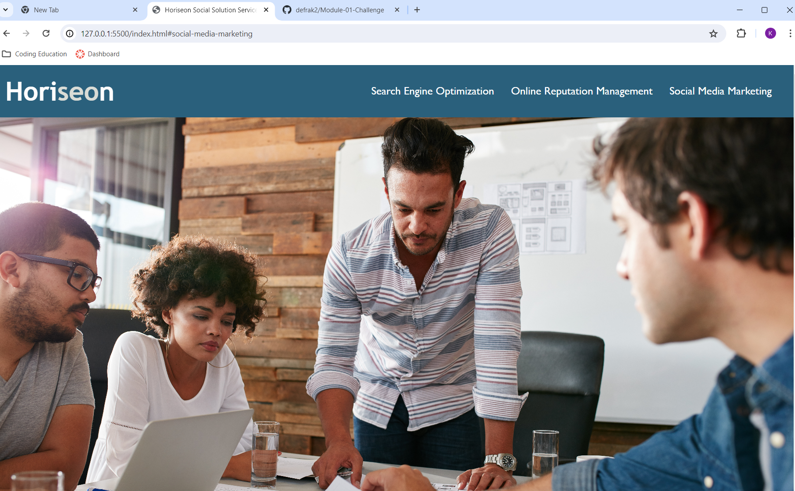
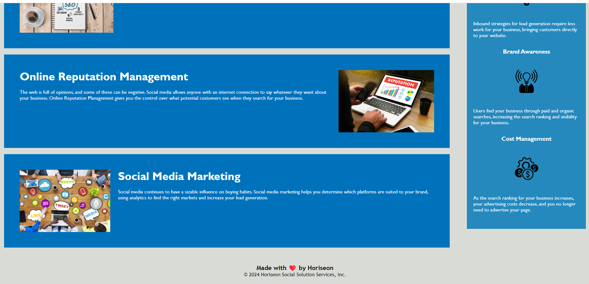

# Module-01-Challenge

## Description

- I was motivated to work on this project to learn how to debug existing code and streamline/consolidate code to be more efficient.
- I built this project to learn alt attributes, consolidation of code, the structure of css and much more.
- The problem that was solved is that the website is more accessible for google searches and for those who cannot see images due to connection issues or inabilities to see. 
- I learned the nav property and how it can be used in html. I learned how to structure the content in css to be more effiecent. As well as the fact that I learned how to make websites more accessible. 

## Usage

https://defrak2.github.io/Module-01-Challenge/

## License

Please refer to the LICENSE in the repo.

---
